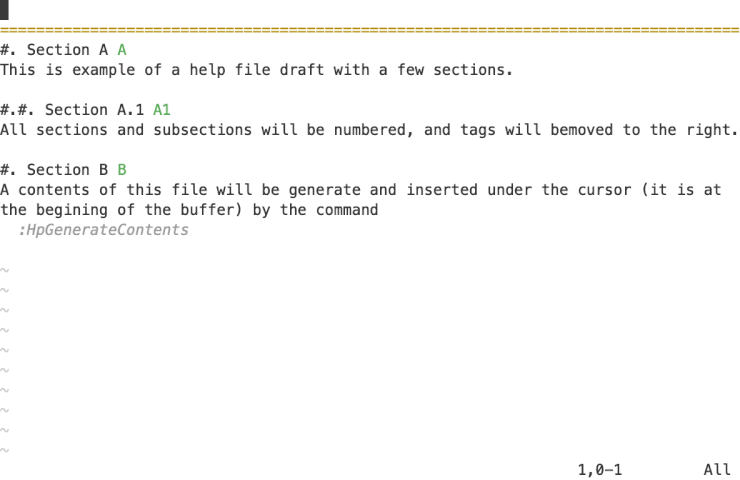

# vim-hp 

[](https://github.com/dokwork/vim-hp/actions/workflows/ci.yml)

  _"Helps to write a help"_

This plugin is created to help you write documentation for your plugins.
The main feature is generating a contents of a vim's help file.

It brings two commands:

```viml
:HpGenerateContents
```
...to generate the contents of the document at the cursor;

and 

```viml
:HpRefresh
```
... to regenerate already existed contents and update numbers of sections in the
document.

||
|----|

Both commands available only for buffers with [filetype](https://vimhelp.org/filetype.txt.html#filetype) `help`.

Read more in the doc: [vim-hp.txt](doc/vim-hp.txt).

## How to install

* With [vim-lug](https://github.com/junegunn/vim-plug/):

```viml
Plug 'dokwork/vim-hp'
```

* With [packer.nvim](https://github.com/wbthomason/packer.nvim/):

```lua
use { 'dokwork/vim-hp' }
```

## Example

Let's look at an example. We wrote our documentation with two sections:
Usage and License. 
```
  1 ▉
  2 ==============================
  3  1. Usage *usage*
  4    Some text...
  5 
  6  2. License	*license*
  7    Some text...
```
Now, we want to build the Contents of our documentation. To do so, we should
put the cursor to the place where the contents should be (position 1:1 in the
example above) and run command `:HpGenerateContents`. It inserts the contents
and move tags in the titles of sections to the right side:
```
  1 CONTENTS
  2   1. Usage.............|usage|
  3   2. License.........|license|
  4 ==============================
  5  1. Usage	 	   *usage*
  6    Some text...
  7 
  8  2. License	         *license*
  9    Some text...
```
Then we decided to add one more section in the middle, let's it be a section
Commands. We can set number 2 for the new section, or let the plugin choose a
number: 
```
  1 CONTENTS
  2   1. Usage.............|usage|
  3   2. License.........|license|
  4 ==============================
  5  1. Usage	  	   *usage*
  6    Some text...
  7 
  8  #. Commands *commands*
  9    Some text...
 10 
 11  2. License	         *license*
 12    Some text...
```
The command `HpRefresh` will update both the contents and titles for us:
```
  1 CONTENTS
  2   1. Usage.............|usage|
  3   2. Commands.......|commands|
  4   3. License.........|license|
  5 ==============================
  6  1. Usage	 	   *usage*
  7    Some text...
  8 
  9  2. Commands        *commands*
 10    Some text...
 11 
 12  3. License	         *license*
 13    Some text...
```
